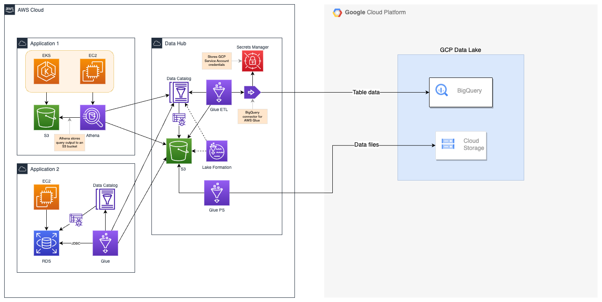

# Data Lake across AWS and GCP cloud platforms

## Overview

This project demonstrates a pattern for implementing a Data Lake strategy across AWS and GCP cloud 
platforms. Furthermore, it describes a cohesive data sharing strategy across multiple applications 
distributed across clouds and across multiple accounts/regions. 

## Architecture

## License

- **[MIT license](http://opensource.org/licenses/mit-license.php)**
- Copyright 2023 &copy; Sachin Hamirwasia
