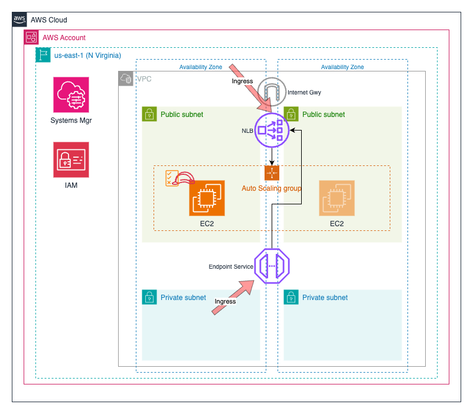

# Introduction

This Terraform module will deploy a cluster of EC2 instances running opensource Squid proxy. 
The module can be used to implement an egress proxy server, to provide access to the Internet
from within a private subnet. 

# Architecture

# License

- **[MIT license](http://opensource.org/licenses/mit-license.php)**
- Copyright 2024 &copy; Sachin Hamirwasia
